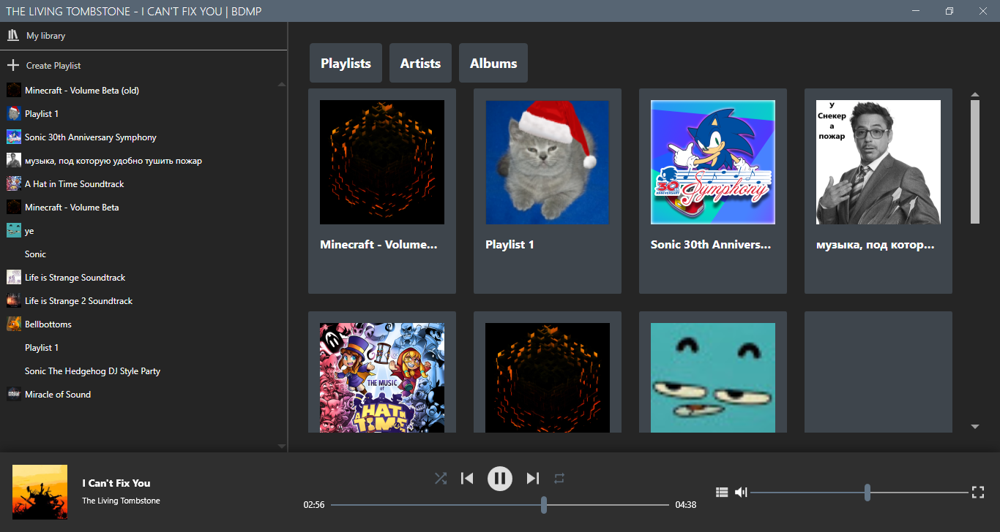
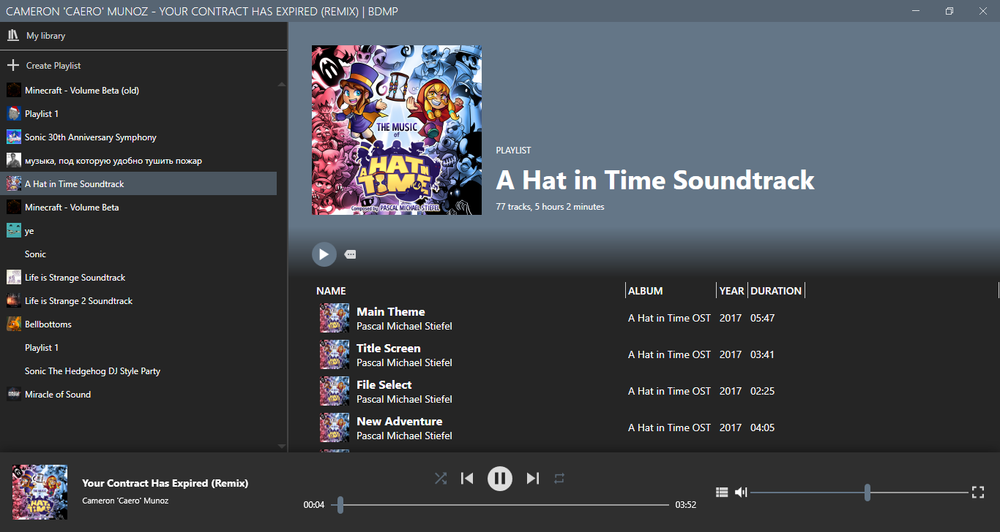
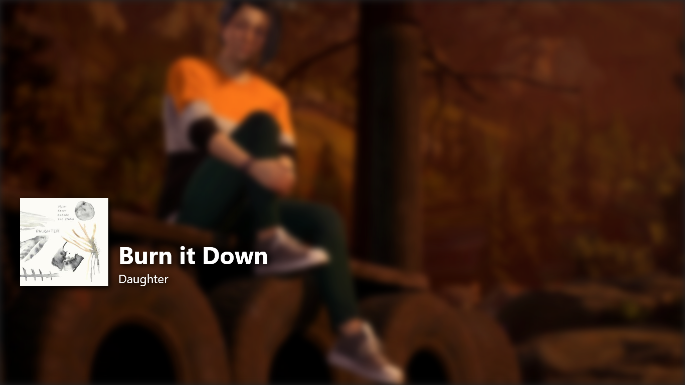

# BowieD.MusicPlayer

This app is supposed to be some kind of test for my UI, SQL and API skills.
It's not supposed to be usable outside of very narrow scope of use by design.
This is also my first app to use page functionality in WPF.

## My Library Page

## Playlist Page

## Fullscreen View

### Features

* Create your own playlists from music you have on your PC.
* Edit song tags within the app.
* Custom backgrounds for fullscreen playback
  * You can set your own backgrounds by either right clicking on background and clicking 'Select background...', or by dropping images in the app
  * Each song can have their own backgrounds, to set custom background for song, right click background and select 'Set song background...'
* You can drop YouTube link in song list to download it by using [yt-dlp](https://github.com/yt-dlp/yt-dlp). You also need to install '[ffmpeg](https://www.ffmpeg.org/)'.
